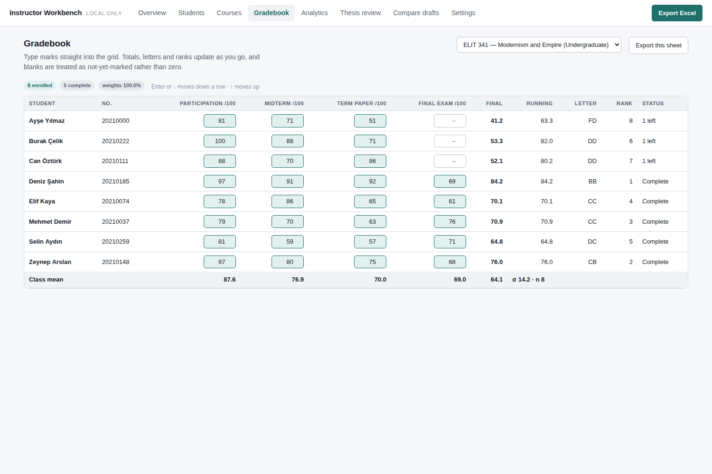
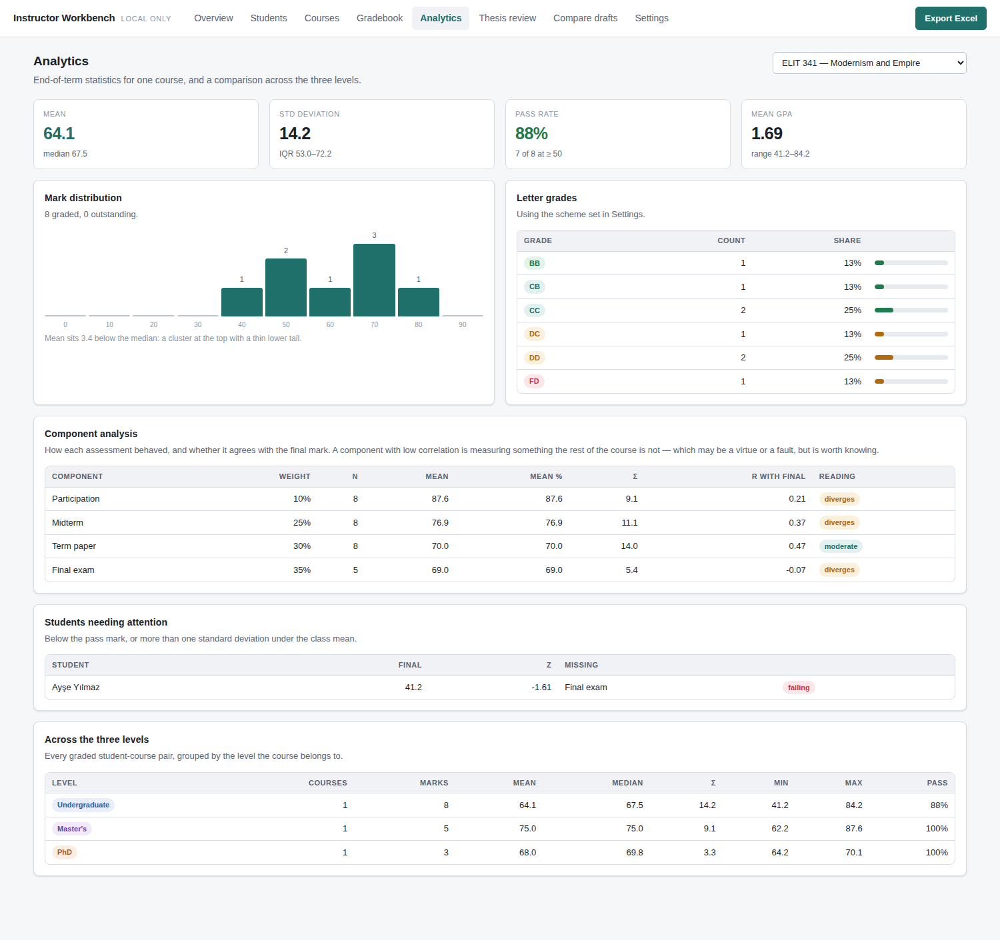
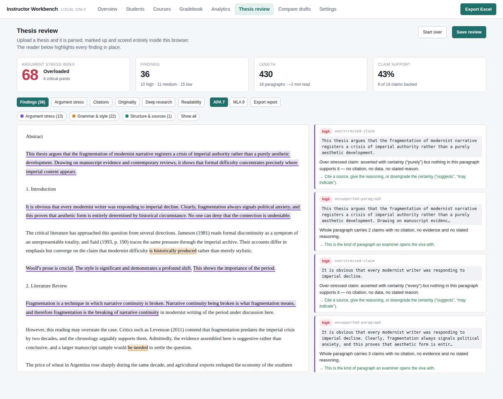
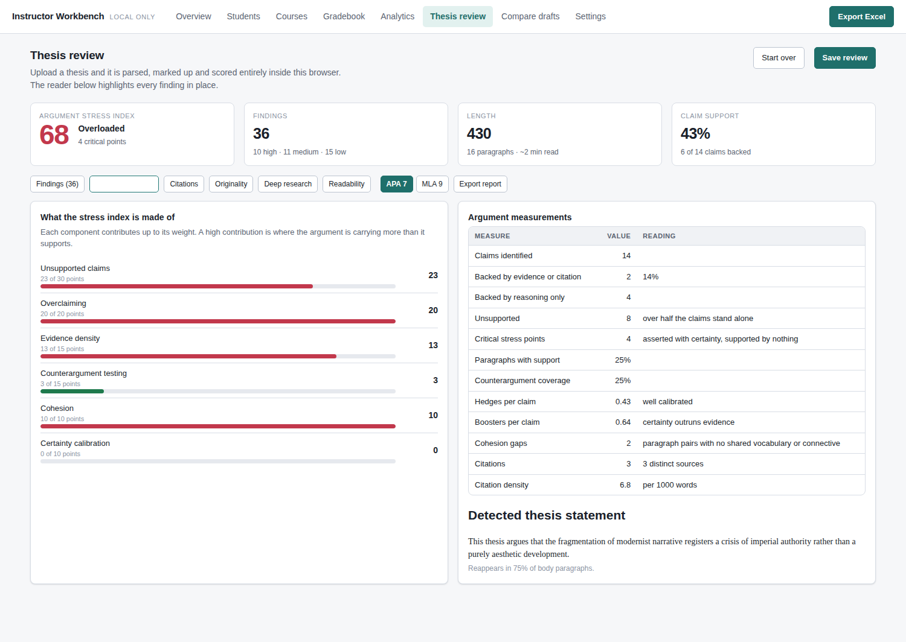
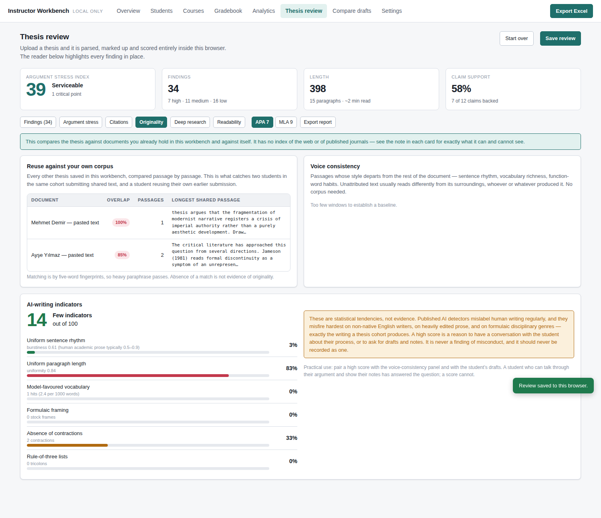
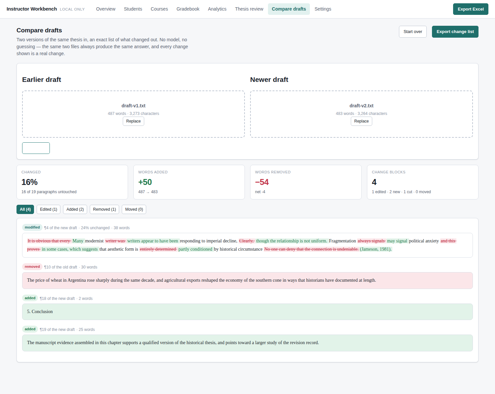

# Instructor Workbench

A grading and thesis-review tool for a university instructor teaching across
three levels. It runs entirely in a browser from a folder of static files.
There is no server, no account, and no build step.

## Getting it running

**1. Start the app.**

```bash
cd instructor
./start.sh            # macOS / Linux   (or: .\start.ps1 on Windows)
```

Then open <http://localhost:8099>. That is the whole install — everything
except AI review works now, with no network and no model.

A plain `file://` open will *not* work: the app is written as ES modules, which
browsers refuse to load from the filesystem. Any static server will do;
`start.sh` just runs Python's.

**2. Try it on the fixtures** in `samples/`, which are built to exercise each
feature. Five minutes, in this order:

| Do this | You should see |
|---|---|
| Thesis review → paste `samples/thesis-v1.txt` → Analyse | Stress **68, Overloaded**. 36 findings highlighted in the text. |
| Argument stress tab | Six over-stressed claims; 6 of 14 claims backed. |
| Citations tab, toggle **APA 7 → MLA 9** | Findings change as the style changes. |
| Assign it to a student, **Save review**. Then analyse `samples/other-student.txt` and save that too. | Two saved reviews. |
| Re-analyse `thesis-v1.txt` → Originality → **Run comparison** | **19% overlap** with the other student, and the shared paragraph quoted. |
| Originality → AI indicators | **12/100.** Now try `samples/ai-flavoured.txt`: **68/100.** That gap is the whole signal — and note how thin it is. |
| Compare drafts → `thesis-v1.txt` and `thesis-v2.txt` | 1 paragraph edited with a word-level diff, 1 cut, 2 added, 16 untouched. |
| Gradebook, then **Export Excel** | A `.xlsx` with a sheet per course plus statistics. |

**3. Add a local model** (only needed for AI review — everything above already
works without it).

```bash
# once
brew install ollama          # or: curl -fsSL https://ollama.com/install.sh | sh
ollama pull qwen2.5:14b      # ~9 GB. llama3.1:8b is ~5 GB and weaker.

# every time, in a second terminal
OLLAMA_ORIGINS=http://localhost:8099 OLLAMA_CONTEXT_LENGTH=32768 ollama serve
```

Then in the app: **Settings → AI review → enable → Local → Ollama →** model
`qwen2.5:14b`, context `32768` → **Test connection**. It should report which
URL answered and list your installed models.

Those two environment variables are not optional:

- **`OLLAMA_ORIGINS`** lets this page talk to Ollama at all. Without it the
  browser blocks the request before it is sent and reports only
  "Failed to fetch".
- **`OLLAMA_CONTEXT_LENGTH`** is the one that quietly ruins results. Ollama's
  default context is a few thousand tokens and it does **not** error when you
  exceed it — it drops the overflow. A 60-page thesis would be reviewed from
  its first three pages while the interface reported a review of the whole
  document. The app refuses to send anything that does not fit and shows the
  arithmetic, but it can only do that if the number in Settings matches the
  number Ollama is actually running.

Roughly: 32k tokens ≈ 90 pages. For a longer thesis, raise both figures or run
the review a chapter at a time.

---

## What it does

**Grades.** One roster across undergraduate, master's and PhD. Courses carry
weighted assessment components. Marks are typed into a spreadsheet-style grid
that recalculates as you go, and a blank is treated as *not yet marked* rather
than as a zero — so the running total is meaningful in week six, and the final
total is meaningful in week fifteen. Both are shown side by side.

**Statistics.** Per course: mean, median, standard deviation, quartiles, pass
rate, grade distribution, and a per-component analysis that reports how well
each assessment correlates with the final mark. Plus a comparison across the
three levels, and a list of students below the pass mark or a standard
deviation under the class mean.

**Excel.** One button exports everything to a single `.xlsx`: overview, roster,
courses with their weightings, a gradebook sheet per course, class statistics,
level comparison, component analysis, and every thesis finding.

**Thesis review.** Upload a `.docx`, `.pdf`, `.rtf`, `.html`, `.md` or `.txt`
and it is parsed and analysed in the browser. Findings are highlighted in place
in a reading pane, colour-coded by category, and listed alongside with the
reason and a suggested fix.

**Draft comparison.** Give it version 1 and version 2 and it reports exactly
what changed — edited paragraphs with a word-level diff, additions, deletions,
and relocations.

---

## The Argument Stress Evaluator

The headline analysis treats the thesis as a structure under load.

Each **claim** is a load-bearing member. **Evidence, citations and stated
reasoning** are its supports. A claim asserted with heavy force — "proves",
"clearly", "every", "undeniably" — while resting on nothing is *over-stressed*:
it is where the argument will fail under examination.

The evaluator locates those points and scores the document 0–100, where higher
means more stress:

| Component | Weight | What it measures |
|---|---|---|
| Unsupported claims | 30 | Share of claims with no citation, evidence or stated reason nearby |
| Overclaiming | 20 | Claims boosted with certainty markers *and* unsupported |
| Evidence density | 15 | Share of body paragraphs carrying any support |
| Counterargument testing | 15 | Share of paragraphs that concede or answer an objection |
| Cohesion | 10 | Paragraph pairs sharing no vocabulary and no connective |
| Certainty calibration | 10 | Hedges per claim, against a healthy band of roughly 0.3–1.2 |

Bands: 0–25 Sound · 26–45 Serviceable · 46–65 Strained · 66–100 Overloaded.

It also reports circular paragraphs, quote-dumping, single-source dependency,
and whether the stated thesis actually recurs through the body.

**It does not judge whether a claim is true.** It measures whether the text does
the work of supporting it.

---

## Honest limits

This matters more than the feature list. Every check states what it can and
cannot see, and the same table is built into the Settings tab.

| Check | Basis | Limit |
|---|---|---|
| Spelling, grammar, punctuation | Rules, offline | Heuristic, tuned for precision. Misses cases rather than inventing them. |
| Argument stress | Rules, offline | Measures support, not truth. |
| Citation style (APA 7 / MLA 9) | Rules, offline | Checks form, not existence. |
| Reuse against your corpus | Fingerprinting, offline | Only sees theses saved in this workbench. Heavy paraphrase passes. |
| Voice consistency | Stylometry, offline | Flags passages unlike the rest. A flag is a question, not an answer. |
| AI-writing indicators | Statistical, offline | **Indicators only.** See below. |
| Citation existence | Crossref + OpenAlex, online | Catches fabricated sources. Older and non-English books are legitimately absent. |
| Prior published work | OpenAlex, online | Titles and abstracts only, not full text. Absence is weak evidence of novelty. |
| Draft comparison | Exact diff, offline | Exact and repeatable. No caveats. |

### Is this stronger than Turnitin?

No — not at the thing Turnitin is actually good at. Turnitin's advantage is not
its algorithm, it is its corpus: roughly 100 million archived student papers
plus licensed publisher content. That cannot be replicated here, and any tool
claiming web-scale plagiarism detection without a licensed index is misleading
you.

What this does that Turnitin does not:

- **Verifies that cited sources exist.** A fabricated reference is perfectly
  formatted and simply is not real. Similarity detection passes it, because
  there is nothing to match. This is the failure mode that matters most now
  that students draft with language models, and it is checked directly against
  Crossref and OpenAlex.
- **Analyses the argument**, not just the wording.
- **Diffs drafts exactly**, so revision can be assessed.
- **Keeps everything local** by default.

Use both if you have both. They answer different questions.

### On AI detection

The AI-writing panel reports statistical tendencies and labels them as such.
Published AI detectors mislabel human writing regularly, and they misfire
hardest on non-native English writers, on heavily edited prose, and on
formulaic disciplinary genres — which is to say, precisely on a thesis cohort
at an international university.

A high score is a reason to talk to the student about their process, or to ask
for drafts and notes. It is not a finding of misconduct and must not be recorded
as one. The caveat is attached to the score in the code, so it cannot be
rendered without it.

---

## Privacy

Grades live in this browser's `localStorage`. Thesis documents live in its
`IndexedDB`. Parsing, analysis, highlighting and Excel generation all happen
locally — the parsing libraries are vendored in `vendor/`, so the app works
with the network disconnected.

Two features reach the network, both only when you press a button:

1. **Deep research** sends *reference strings* to Crossref and OpenAlex, and
   the *thesis statement* to OpenAlex. Never the thesis text, never a student
   name.
2. **AI review** is off by default. When enabled you choose the destination: a
   local model (Ollama, LM Studio, llama.cpp, vLLM) so nothing leaves your
   machine, or the Claude API, which transmits the thesis text to Anthropic and
   says so in the interface.

### Local model backends

Settings → AI review → Local carries presets for the common runtimes. They
differ only in where they mount their OpenAI-compatible API:

| Backend | Endpoint | API key |
|---|---|---|
| Ollama | `http://localhost:11434/v1` | none |
| Open WebUI | `http://localhost:3000/api` | required — Settings → Account |
| LM Studio | `http://localhost:1234/v1` | none |
| llama.cpp (`llama-server`) | `http://localhost:8080/v1` | none |

**Open WebUI is useful here as an installer and model manager, not as a
feature.** It bundles Ollama, gives you a GUI for pulling and switching models,
and then exposes them on the endpoint above. If you are already comfortable
running Ollama directly, it adds a layer you do not need — point this app at
Ollama and skip it.

**Whichever you choose, the CORS setting is the part that will bite you.** This
app runs on its own origin and calls the model server on another, so the server
has to be told to allow it. Otherwise the browser blocks the request before it
is sent, and reports only "Failed to fetch":

```bash
# Ollama
OLLAMA_ORIGINS=http://localhost:8099 ollama serve

# Open WebUI (docker)
docker run -d -p 3000:8080 \
  -e CORS_ALLOW_ORIGIN=http://localhost:8099 \
  -v open-webui:/app/backend/data \
  ghcr.io/open-webui/open-webui:main
```

LM Studio has a CORS toggle in its Developer/server panel.

Use **Test connection** in Settings before running a review. It reports which
URL answered and lists the model names that server will accept, and if it
fails it names the origin that needs allowing rather than leaving you with a
bare network error.

An API key entered for the Claude option is stored in local storage in plain
text and is readable by anyone with access to the computer. Use a key you can
revoke.

Take backups. Browser storage is durable but not guaranteed — the browser can
clear it. Settings → Download backup produces one JSON file containing
everything, including full thesis texts.

---

## Layout

```
instructor/
  index.html            app shell
  styles.css            light and dark
  vendor/               SheetJS, mammoth, pdf.js — vendored so it runs offline
  js/
    app.js              routing
    store.js            state; localStorage + IndexedDB
    stats.js            descriptive statistics
    ui.js               DOM helpers
    io/files.js         .docx / .pdf / .rtf / .html / .txt → text
    export/workbook.js  Excel and CSV
    views/              one module per tab
    analysis/
      text.js           offset-preserving segmentation
      lexicons.js       word lists — tune these to your discipline
      mechanics.js      spelling, punctuation, spacing
      grammar.js        agreement, splices, fragments, register
      argument.js       the Argument Stress Evaluator
      citations.js      APA 7 / MLA 9 conformance
      overview.js       readability, structure, reference cross-check
      similarity.js     reuse fingerprinting, stylometry, AI indicators
      compare.js        exact draft diffing
      verify.js         Crossref / OpenAlex lookups
      ai.js             optional model review
      index.js          orchestrator and highlight segmentation
```

Every analyser returns findings carrying absolute character offsets into the
original text. That invariant is what lets one word carry two overlapping
findings without breaking the markup, and it is worth preserving in any change.

## Tuning it

`js/analysis/lexicons.js` holds the word lists: misspellings, hedges, boosters,
claim verbs, evidence markers, wordy phrases, expected section names. A
discipline with its own conventions is a lexicon edit, not a code change.

Grading scheme, pass mark and letter bands are in Settings.

## Screenshots

`docs/screens/` holds a capture of each tab, generated from demo data.

| | |
|---|---|
|  |  |
|  |  |
|  |  |
